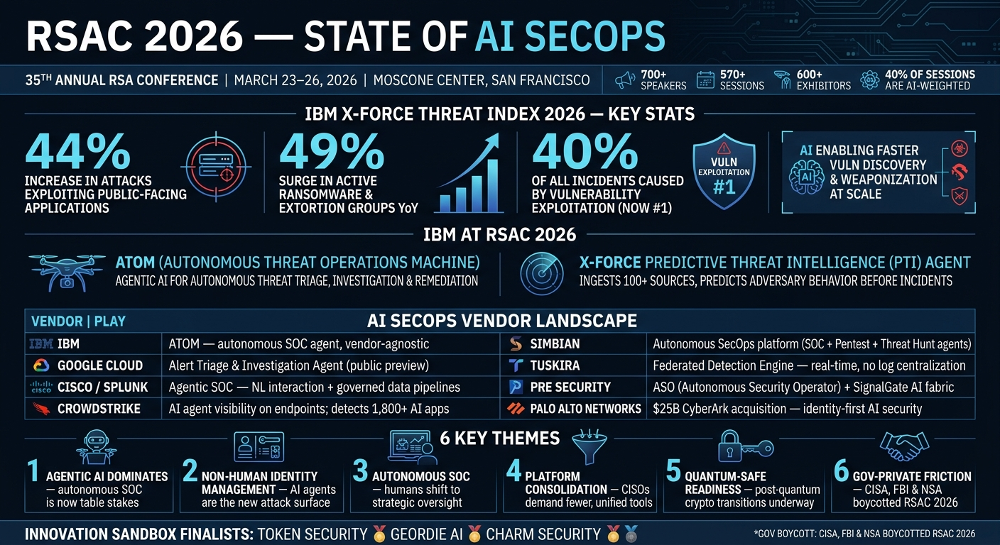

# RSAC 2026 Briefings

Daily intelligence reports from RSA Conference 2026, Moscone Center, San Francisco — March 23–26, 2026.

## Reports

- [Day 1 — March 23, 2026](RSAC-2026-Day1-Report.md) — Opening day: AI SecOps vendor landscape, IBM ATOM, Innovation Sandbox, government boycott, and daily session highlights

## Infographics

## Key Topics Covered

- AI-powered Security Operations (AI SecOps / Autonomous SOC)
- IBM ATOM & X-Force Predictive Threat Intelligence
- Vendor announcements: Simbian, Tuskira, PRE Security, Google Cloud, CrowdStrike, Cisco/Splunk, Palo Alto Networks
- RSAC Innovation Sandbox 2026 finalists
- CISA/FBI/NSA boycott — government-private sector friction
- Daily trending sessions & keynote schedule
